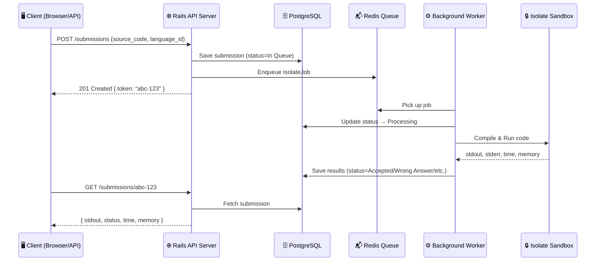
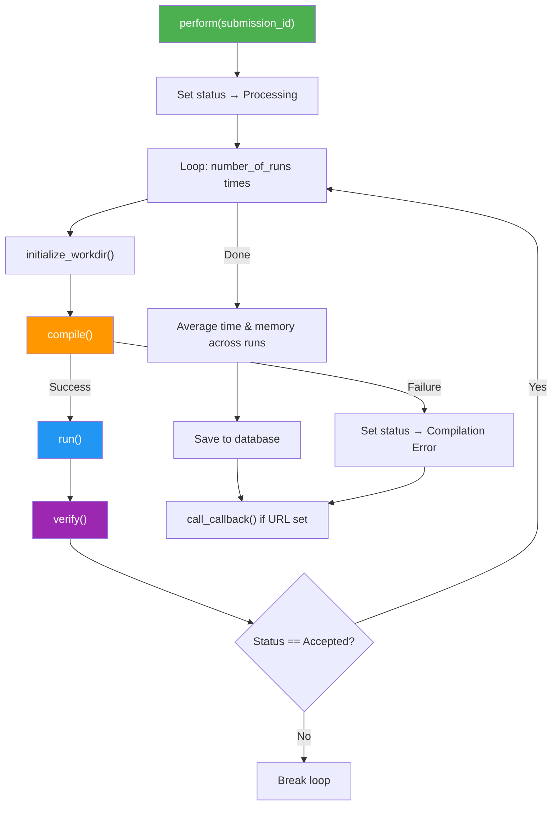

# Judge0 Codebase — Zero to Hero Walkthrough 🎓

> **What is Judge0?** An open-source, **online code execution system**. You send it source code (Python, C++, Java — 60+ languages), and it compiles & runs it in a **sandboxed** environment and gives you the output. Think of it as the engine behind platforms like LeetCode, HackerRank, or any "Run Code" button on the web.

---

## 1. The Big Picture — How Judge0 Works



> **Key Insight:** The API server and the workers are **separate processes**. The API just saves the submission and puts it in a queue. A background worker picks it up, runs the code inside a secure sandbox called **Isolate**, and writes the results back to the database.

---

## 2. The `app/` Directory — Folder Structure

```
app/
├── channels/          ← ActionCable (WebSocket) boilerplate — not actively used
├── controllers/       ← 🌐 API endpoints — the "front door"
│   ├── application_controller.rb
│   ├── sessions_controller.rb      ← Authentication & Authorization
│   ├── submissions_controller.rb   ← ⭐ THE main controller
│   ├── languages_controller.rb     ← List programming languages
│   ├── statuses_controller.rb      ← List possible statuses
│   ├── health_controller.rb        ← Worker health checks
│   ├── home_controller.rb          ← Homepage / Docs
│   └── info_controller.rb          ← System info, config, stats
├── enumerations/
│   └── status.rb                   ← ⭐ All possible submission statuses
├── helpers/
│   ├── config.rb                   ← ⭐ All configuration constants
│   ├── isolate_runner.rb           ← Orchestrates sync/async job execution
│   ├── nil_value.rb                ← Tiny utility for nil defaults
│   └── system_info.rb              ← CPU & memory info reader
├── jobs/
│   ├── application_job.rb          ← Base job class
│   └── isolate_job.rb              ← ⭐⭐ THE HEART — compiles & runs code
├── mailers/                        ← Boilerplate (unused)
├── models/
│   ├── language.rb                 ← Language model (C++, Python, etc.)
│   └── submission.rb               ← ⭐ Submission model — validations & encoding
├── serializers/
│   ├── language_serializer.rb      ← JSON shape for Language
│   ├── status_serializer.rb        ← JSON shape for Status
│   └── submission_serializer.rb    ← JSON shape for Submission
├── services/
│   ├── base64_service.rb           ← Encode/Decode Base64
│   └── fields/submission.rb        ← Field selection for API responses
└── views/
    └── layouts/                    ← Mailer layouts (boilerplate)
```

---

## 3. The Routes — What URLs Does Judge0 Expose?

Think of `config/routes.rb` as the **"table of contents"** for the API. It maps URLs to controller actions.

| HTTP Method | URL | Controller#Action | What it does |
|---|---|---|---|
| `GET` | `/` | `home#index` | Homepage or API docs |
| `POST` | `/submissions` | `submissions#create` | **Submit code to run** |
| `GET` | `/submissions/:token` | `submissions#show` | **Get result of a submission** |
| `GET` | `/submissions` | `submissions#index` | List all submissions (admin) |
| `DELETE` | `/submissions/:token` | `submissions#destroy` | Delete a submission |
| `POST` | `/submissions/batch` | `submissions#batch_create` | Submit multiple codes at once |
| `GET` | `/submissions/batch` | `submissions#batch_show` | Get multiple results at once |
| `GET` | `/languages` | `languages#index` | List active languages |
| `GET` | `/languages/all` | `languages#all` | List all languages (incl. archived) |
| `GET` | `/languages/:id` | `languages#show` | Get details of one language |
| `GET` | `/statuses` | `statuses#index` | List all possible statuses |
| `POST` | `/authenticate` | `sessions#authenticate` | Verify your API token |
| `POST` | `/authorize` | `sessions#authorize` | Verify admin access |
| `GET` | `/workers` | `health#workers` | Check worker health |
| `GET` | `/system_info` | `info#system_info` | CPU/memory info |
| `GET` | `/config_info` | `info#config_info` | Current config values |
| `GET` | `/about` | `info#about` | Version, homepage |
| `GET` | `/statistics` | `info#statistics` | Submission stats |

---

## 4. Controllers — Deep Dive (Layer by Layer)

### 4.1 `SessionsController` — The Security Guard 🔐

This is the **base class** that every other controller inherits from (via `ApplicationController`). Every single API request passes through its `before_action` filters.

```ruby
class SessionsController < ActionController::API
  before_action :verify_ip_address      # Step 1: Is this IP allowed?
  before_action :authenticate_request   # Step 2: Does the request have a valid API token?
  before_action :authorize_request, only: [:authorize]  # Step 3: Admin-level check
```

**What it does, step by step:**

1. **IP Filtering** — You can set `DISALLOW_IP` and `ALLOW_IP` environment variables. If a request comes from a disallowed IP → **403 Forbidden**.
2. **Authentication** — Checks if the request header contains the correct `authn_token`. Uses `secure_compare` to prevent timing attacks (a real-world security technique!).
3. **Authorization** — A stricter check for admin operations like listing all submissions. Uses a separate `authz_token`.
4. **Maintenance Mode** — If `MAINTENANCE_MODE=true`, returns **503 Service Unavailable** with a custom message.

> **Beginner Tip:** `before_action` is a Rails concept — it means "run this method before every controller action." It's like a security checkpoint at an airport.

---

### 4.2 `ApplicationController` — The Middle Layer

```ruby
class ApplicationController < SessionsController
  private

  def pagination_dict(collection)
    {
      current_page: collection.current_page,
      next_page: collection.next_page,
      prev_page: collection.previous_page,
      total_pages: collection.total_pages,
      total_count: collection.total_entries
    }
  end
end
```

**Why does it exist?** It inherits from `SessionsController` (so all security checks apply automatically) and adds a shared helper for **pagination** — when you have 10,000 submissions, you don't want to load them all at once. Instead, you get them page by page (20 per page).

---

### 4.3 `SubmissionsController` — The Star of the Show ⭐

This is where the magic happens. Let's break down each action:

#### `create` — Submitting Code

```
POST /submissions
Body: { source_code: "print('hello')", language_id: 71 }
```

**Flow:**
1. Validate and save the submission to the database
2. If `?wait=true` → Run the code **synchronously** (wait for the result before responding)
3. If `?wait=false` (default) → Put in queue and immediately return a **token**
4. The client uses the token to poll for results later

#### `show` — Getting Results

```
GET /submissions/abc-123-def-456
```

Returns the submission's result: stdout, stderr, compile_output, status, time, memory. Results are **cached** in Redis for performance.

#### `batch_create` & `batch_show` — Bulk Operations

Submit/retrieve up to N submissions at once (configurable, default max = 20). Think of it like sending 20 code files to grade in one API call.

#### Important `before_action` filters:

| Filter | Purpose |
|---|---|
| `authorize_request` | Only admins can list/delete submissions |
| `check_maintenance` | Block creates during maintenance |
| `check_wait` | Validates the `?wait=true` parameter |
| `check_batched_submissions` | Ensure batch mode is enabled |
| `check_queue_size` | Reject if queue is full (prevents overload) |
| `check_requested_fields` | Validate `?fields=stdout,time` parameter |
| `set_base64_encoded` | Handle Base64 encoding toggle |

#### Base64 Encoding — Why?

Source code can contain special characters, binary data, or non-UTF-8 characters. Base64 encoding converts everything into safe ASCII text. Judge0 stores everything as Base64 internally and decodes on the fly.

---

### 4.4 `LanguagesController` — The Language Catalog

```ruby
class LanguagesController < ApplicationController
  def index  # GET /languages      → only active (non-archived) languages
  def all    # GET /languages/all  → ALL languages, including archived
  def show   # GET /languages/42   → details of one language
end
```

Simple CRUD. The `default_scope` on the `Language` model automatically filters out archived languages.

---

### 4.5 `StatusesController` — Status Definitions

```ruby
class StatusesController < ApplicationController
  def index
    render json: Status.all, each_serializer: StatusSerializer
  end
end
```

Returns the list of 14 possible statuses (In Queue, Processing, Accepted, Wrong Answer, etc.). These are defined as an **enumeration**, not a database table.

---

### 4.6 `HealthController` — Worker Health Dashboard

```ruby
def workers
  # Returns per-queue stats: how many workers are available, idle, working, paused
end
```

Uses **Resque** (a Redis-based background job library) to inspect worker states. This is what monitoring dashboards call to check if the system is healthy.

---

### 4.7 `InfoController` — System Diagnostics

Provides endpoints for:
- **`/system_info`** — CPU architecture, cores, memory (reads from `lscpu` and `free` Linux commands)
- **`/config_info`** — All configuration values (time limits, memory limits, enabled features)
- **`/statistics`** — Submission counts by language, by status, per day (last 30 days), database size
- **`/about`**, **`/version`**, **`/license`**, **`/isolate`** — Metadata

> **Real-World Pattern:** The statistics endpoint uses **Rails caching** (`Rails.cache.fetch`) with a 10-minute TTL to avoid hammering the database on every request.

---

## 5. Models — The Data Layer

### 5.1 `Language` Model

```ruby
# Database columns:
#   id, name, compile_cmd, run_cmd, source_file, is_archived

class Language < ApplicationRecord
  validates :name, presence: true
  validates :source_file, :run_cmd, presence: true, unless: -> { is_project }
  default_scope { where(is_archived: false).order(name: :asc) }
end
```

**Key concepts:**
- `compile_cmd` — The shell command to compile (e.g., `gcc -o a.out source.c %s` where `%s` is replaced by compiler options). `nil` for interpreted languages like Python.
- `run_cmd` — The shell command to run (e.g., `./a.out` or `python3 source.py`)
- `source_file` — The filename for the source code (e.g., `source.py`, `Main.java`)
- `is_archived` — Languages can be retired without deleting them
- `is_project` — Special "Multi-file program" language for zip-based submissions

---

### 5.2 `Submission` Model — The Core Business Object ⭐

This is the most complex model. A submission represents **one code execution request**.

#### Database Columns:

| Column | Purpose |
|---|---|
| `token` | UUID — the public identifier (never expose database IDs!) |
| `source_code` | The code to execute (stored as Base64) |
| `language_id` | Which language to compile/run with |
| `stdin` | Input to feed to the program |
| `expected_output` | For auto-grading: what the output should be |
| `stdout` | What the program printed to standard output |
| `stderr` | Error output from the program |
| `compile_output` | Compiler messages (errors, warnings) |
| `status_id` | Current status (1=Queue, 2=Processing, 3=Accepted, etc.) |
| `time` | CPU time used (seconds) |
| `wall_time` | Real-world wall clock time |
| `memory` | Memory used (KB) |
| `exit_code` | Program's exit code |
| `exit_signal` | Signal that killed the program (SIGSEGV, etc.) |
| `cpu_time_limit` | Max CPU time allowed |
| `memory_limit` | Max memory allowed |
| `callback_url` | URL to notify when execution completes |
| `additional_files` | Extra files (as a zip, Base64 encoded) |
| `enable_network` | Whether the program can access the internet |

#### Validations — The Guardrails:

```ruby
validates :cpu_time_limit,
          numericality: { greater_than_or_equal_to: 0,
                          less_than_or_equal_to: Config::MAX_CPU_TIME_LIMIT }
```

Every resource limit (CPU, memory, processes, file size) is validated against a **maximum** defined in `Config`. This prevents users from requesting 1TB of memory or infinite CPU time.

#### Base64 Encoding Pattern:

```ruby
def source_code
  @decoded_source_code ||= Base64Service.decode(self[:source_code])
end

def source_code=(value)
  super(value)
  self[:source_code] = Base64Service.encode(self[:source_code])
end
```

**What's happening:** Data is **always stored as Base64** in the database. When you read `submission.source_code`, it **automatically decodes** it for you. When you write, it **automatically encodes**. The `||=` operator is **memoization** — decode once, cache the result.

#### Token Generation:

```ruby
def generate_token
  begin
    self.token = SecureRandom.uuid
  end while self.class.exists?(token: token)
end
```

Generates a UUID like `"a1b2c3d4-e5f6-7890-abcd-ef1234567890"`. The `while` loop ensures uniqueness (astronomically unlikely to collide, but safety first!).

---

## 6. The `Status` Enumeration — All Possible Outcomes

```ruby
class Status < Enumerations::Base
  values queue:     { id:  1, name: 'In Queue' },
         process:   { id:  2, name: 'Processing' },
         ac:        { id:  3, name: 'Accepted' },
         wa:        { id:  4, name: 'Wrong Answer' },
         tle:       { id:  5, name: 'Time Limit Exceeded' },
         ce:        { id:  6, name: 'Compilation Error' },
         sigsegv:   { id:  7, name: 'Runtime Error (SIGSEGV)' },
         sigxfsz:   { id:  8, name: 'Runtime Error (SIGXFSZ)' },
         sigfpe:    { id:  9, name: 'Runtime Error (SIGFPE)' },
         sigabrt:   { id: 10, name: 'Runtime Error (SIGABRT)' },
         nzec:      { id: 11, name: 'Runtime Error (NZEC)' },
         other:     { id: 12, name: 'Runtime Error (Other)' },
         boxerr:    { id: 13, name: 'Internal Error' },
         exeerr:    { id: 14, name: 'Exec Format Error' }
end
```

**Beginner translations:**
- **SIGSEGV** — Program tried to access memory it shouldn't (null pointer, buffer overflow)
- **SIGXFSZ** — Program tried to create a file that's too large
- **SIGFPE** — Division by zero
- **SIGABRT** — Program called `abort()` (assertion failure)
- **NZEC** — Non-Zero Exit Code — program crashed but not with a specific signal
- **TLE** — Your loop is infinite or your algorithm is too slow
- **CE** — Your code has syntax errors
- **boxerr** — Something went wrong with the sandbox itself

---

## 7. `IsolateJob` — The Heart of the System ⭐⭐

This is where code **actually gets compiled and executed**. Let's trace through the entire lifecycle:

### 7.1 The Execution Pipeline



### 7.2 `initialize_workdir` — Setting Up the Sandbox

```ruby
@workdir = `isolate #{cgroups} -b #{box_id} --init`.chomp
```

Uses the **Isolate** tool (a Linux sandboxing utility) to create an isolated directory. Think of it as creating a mini virtual machine:
- `boxdir` — Where the source code lives (`/box`)
- `tmpdir` — Temporary space (`/tmp`)
- stdin/stdout/stderr files are created for I/O

The source code and stdin are written as real files inside this sandbox.

### 7.3 `compile` — Building the Code

1. Creates a `compile.sh` script using the language's `compile_cmd`
2. Runs it inside isolate with **strict limits** (max CPU, max memory, max file size)
3. If compilation fails → sets status to `Compilation Error`, saves the compiler output, and returns `:failure`
4. If it times out → "Compilation time limit exceeded"

### 7.4 `run` — Executing the Code

1. Creates a `run.sh` script using the language's `run_cmd`
2. Runs it inside isolate with the **user's specified limits** (or defaults)
3. Stdin is piped in from the `stdin.txt` file
4. Stdout and stderr are captured to files

**The isolate command** has flags for:
- `-t` — CPU time limit
- `-w` — Wall time limit
- `-k` — Stack size limit
- `-p` — Max processes/threads
- `--cg-mem` — Memory limit (using cgroups)
- `-f` — Max output file size
- `--share-net` — Allow network access (if enabled)
- `-s` — Silent mode

### 7.5 `verify` — Determining the Result

After execution, the job reads:
1. **Metadata file** — isolate writes time, memory usage, exit status
2. **stdout & stderr files** — program output

Then `determine_status` decides the verdict:

```ruby
def determine_status(status, exit_signal)
  if status == "TO"       → Time Limit Exceeded
  elsif status == "SG"    → Runtime Error (maps signal to specific type)
  elsif status == "RE"    → Runtime Error (NZEC)
  elsif status == "XX"    → Internal Error (sandbox failure)
  elsif expected_output.nil? || expected_output == stdout
                          → Accepted ✅
  else                    → Wrong Answer ❌
  end
end
```

> **Key Insight:** If no `expected_output` was provided, the submission is **always Accepted** (it's just running code, not judging it). If `expected_output` is provided, it compares the output (after stripping trailing whitespace).

### 7.6 `cleanup` — Tear Down the Sandbox

```ruby
`isolate #{cgroups} -b #{box_id} --cleanup`
```

Destroys the sandbox directory. If cleanup fails, it raises an exception — leaving a sandbox around is a security risk!

### 7.7 `call_callback` — Webhook Notification

If the submission has a `callback_url`, Judge0 sends a PUT request with the results (Base64 encoded). Retries up to `CALLBACKS_MAX_TRIES` times.

---

## 8. Helper Modules

### 8.1 `Config` — The Control Panel 🎛️

Every configurable behavior is an environment variable with a sensible default:

| Config | Default | What it controls |
|---|---|---|
| `CPU_TIME_LIMIT` | 5s | Default CPU time for submissions |
| `MAX_CPU_TIME_LIMIT` | 15s | Maximum CPU time a user can request |
| `MEMORY_LIMIT` | 128MB | Default memory limit |
| `MAX_MEMORY_LIMIT` | 512MB | Maximum memory a user can request |
| `MAX_QUEUE_SIZE` | 100 | Max submissions waiting in queue |
| `ENABLE_CALLBACKS` | true | Allow webhook notifications |
| `ENABLE_NETWORK` | false | Allow code to access the internet |
| `SUBMISSION_CACHE_DURATION` | 1s | How long to cache submission results |
| `MAX_SUBMISSION_BATCH_SIZE` | 20 | Max submissions in one batch |

> **Design Pattern:** Config is loaded **once at startup** from environment variables. This is the **12-Factor App** approach — all configuration lives in the environment, not in code.

### 8.2 `IsolateRunner` — Sync vs Async

```ruby
module IsolateRunner
  def self.perform_now(submission)    # Synchronous: wait for result
    perform_later(submission)          # Still queues it...
    # ...then polls the database until the status changes
    sleep(2)  # initial wait
    loop { break if status changed; sleep(incrementing_delay) }
  end

  def self.perform_later(submission)  # Asynchronous: fire and forget
    submission.update(status: Status.queue)
    IsolateJob.perform_later(submission.id)
  end
end
```

`perform_now` is clever — it doesn't run the job in the API process. It still queues it for a worker, then **polls** the database with exponential backoff to wait for the result (max 600 seconds).

### 8.3 `Base64Service` — Encoding Wrapper

```ruby
module Base64Service
  def self.encode(text)
    return nil unless text
    Base64.encode64(text)
  end

  def self.decode(text)
    return nil unless text
    Base64.decode64(text)
  end
end
```

A thin wrapper around Ruby's built-in Base64 module with nil-safety.

---

## 9. Serializers — Shaping the JSON Response

### `SubmissionSerializer` — What the API Returns

```ruby
class SubmissionSerializer < ActiveModel::Serializer
  # Default fields returned (optimized — not everything):
  # token, time, memory, stdout, stderr, compile_output, message, status
```

**Key behaviors:**
- Handles Base64 encoding/decoding based on the `base64_encoded` parameter
- The `status` field is embedded as `{ id: 3, description: "Accepted" }` instead of just an ID
- The `language` field is embedded as `{ id: 71, name: "Python (3.8.1)" }`
- Clients can request specific fields with `?fields=stdout,time,status`
- Use `?fields=*` to get ALL fields

---

## 10. Services — Business Logic Helpers

### `Fields::Submission` — Field Selection Service

```ruby
fields = Fields::Submission.new("stdout,time,status")
fields.requested_fields  # => [:stdout, :time, :status]
fields.invalid_fields     # => []
fields.has_invalid_fields? # => false
```

Parses the `?fields=...` query parameter, validates each field name against the serializer's available attributes, and falls back to defaults if none specified.

---

## 11. The Complete Request Lifecycle — A Story

Let's trace a complete request from start to finish:

```
1. Client sends: POST /submissions
   Body: { source_code: "print('Hello')", language_id: 71 }

2. SessionsController.verify_ip_address → IP is allowed ✅
3. SessionsController.authenticate_request → Token is valid ✅

4. SubmissionsController.create:
   a. check_queue_size → Queue has space ✅
   b. Build Submission object with defaults:
      - cpu_time_limit = 5s
      - memory_limit = 128000 KB
      - status = "In Queue"
   c. Validate: language exists, limits within bounds ✅
   d. generate_token → "a1b2c3d4-..."
   e. source_code is Base64-encoded and saved to PostgreSQL
   f. IsolateRunner.perform_later:
      - Update status = "In Queue"
      - IsolateJob.perform_later(submission.id) → Redis queue
   g. Return: 201 { token: "a1b2c3d4-..." }

5. Background Worker picks up the job:
   a. IsolateJob.perform(42):
      - Status → "Processing"
      - `isolate --init` → creates /var/local/lib/isolate/42/box/
      - Write "print('Hello')" → /box/source.py
      - No compile step for Python (compile_cmd is nil)
      - Run: `isolate -t 5 -w 10 --cg-mem=128000 -- /bin/bash run.sh < stdin.txt > stdout.txt`
      - Read stdout.txt → "Hello\n"
      - Read metadata.txt → time=0.01, memory=3000
      - No expected_output → Status = Accepted ✅
      - Save results to database
      - Cleanup sandbox

6. Client polls: GET /submissions/a1b2c3d4-...
   → { stdout: "Hello\n", status: { id: 3, description: "Accepted" },
       time: "0.01", memory: 3000 }
```

---

## 12. Architecture Patterns Used (Industry Best Practices)

| Pattern | Where | Why |
|---|---|---|
| **MVC** | Controllers, Models, Serializers (Views) | Clean separation of concerns |
| **API-only Rails** | `ActionController::API` | No browser views — pure JSON API |
| **Background Jobs** | Resque + IsolateJob | Don't block the API while code runs |
| **Token-based access** | UUID tokens instead of database IDs | Security — never expose auto-incrementing IDs |
| **12-Factor Config** | `Config` module + ENV vars | Configuration in environment, not code |
| **Pagination** | `will_paginate` gem | Handle large datasets efficiently |
| **Caching** | `Rails.cache.fetch` | Reduce database load for hot paths |
| **Base64 encoding** | Throughout | Handle binary/special character data safely |
| **Serializers** | `ActiveModel::Serializer` | Control exactly what JSON the API returns |
| **Sandboxing** | Isolate + cgroups | Security isolation for untrusted code |
| **Callbacks/Webhooks** | `callback_url` | Async notification pattern |
| **IP Allowlist/Blocklist** | SessionsController | Defense in depth |

---

## 13. Key Takeaways for Beginners

1. **Separation of concerns is everything** — The API server doesn't run code. It just saves requests and delegates to workers.

2. **Security is layered** — IP filtering → Authentication → Authorization → Sandboxing → Resource limits. Multiple walls, not just one.

3. **Everything is configurable** — Every limit, every feature toggle is an environment variable. No hardcoded values.

4. **Base64 is your friend** — When dealing with arbitrary user input (code in 60+ languages), encode everything to avoid encoding issues.

5. **Background processing** — Never do slow work in an API request. Queue it, return immediately, let the client poll.

6. **UUIDs over auto-increment IDs** — Public-facing identifiers should be unguessable.

7. **Caching avoids repeat work** — The submission `show` endpoint caches results because a client may poll it many times.

8. **Linux sandboxing (Isolate + cgroups)** is how real systems run untrusted code safely — with strict CPU, memory, process, and filesystem limits.
